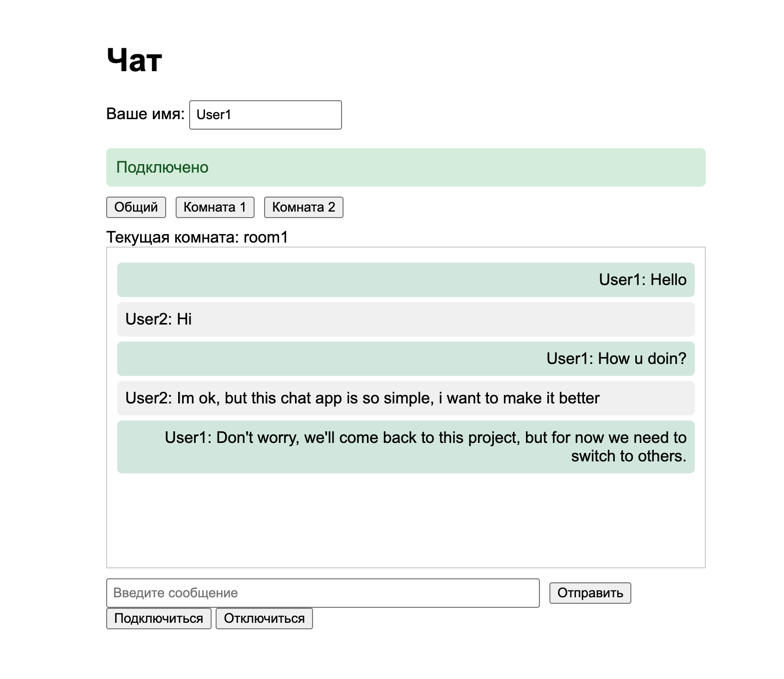
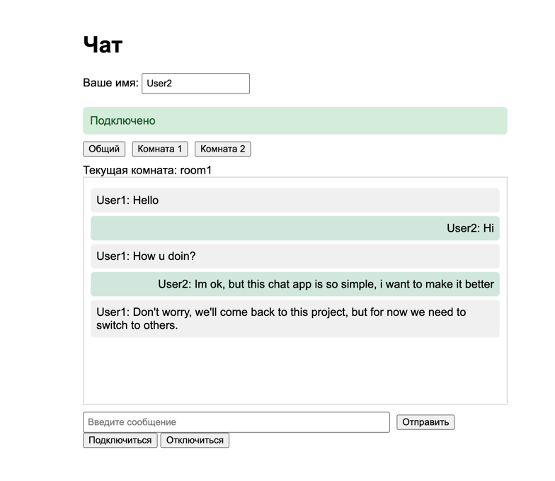

# Чат-приложение на Kafka и WebSocket

Чат реального времени, построенный на Spring Boot, Apache Kafka и WebSocket (STOMP).

## Архитектура

```
Браузер ──HTTP POST──→ Producer ──→ Kafka ──→ Consumer ──→ WebSocket ──→ Браузеры
```

## Модули

### chat-api
Общий модуль с DTO и интерфейсами, используемыми в других сервисах.

- `ChatMessage` — модель сообщения (username, content, roomId, timestamp)
- `MessageSender` — интерфейс для отправки сообщений
- `MessageReceiver` — интерфейс для получения сообщений

### chat-producer-service
REST API сервис для отправки сообщений в Kafka.

- **Порт:** 8085
- **Эндпоинт:** `POST /api/v1/send`
- Принимает сообщения по HTTP и публикует их в топик Kafka

### chat-consumer-service
Сервис, который читает сообщения из Kafka и рассылает их через WebSocket.

- **Порт:** 8090
- **WebSocket эндпоинт:** `/ws`
- **STOMP destinations:** `/topic/chat/{roomId}`
- Слушает топик Kafka и отправляет сообщения подписанным клиентам

### chat-db
Модуль для работы с базой данных (для будущей реализации).

## Принцип работы

1. **Пользователь отправляет сообщение** через веб-интерфейс
2. **Браузер отправляет HTTP POST** запрос на Producer сервис
3. **Producer публикует** сообщение в топик Kafka
4. **Consumer получает** сообщение из Kafka
5. **Consumer рассылает** сообщение через WebSocket всем клиентам, подписанным на комнату
6. **Браузеры получают** сообщение в реальном времени

### Система комнат

Пользователи могут присоединяться к разным чат-комнатам. Каждая комната имеет свой STOMP destination:
- `/topic/chat/general` — общий чат
- `/topic/chat/room1` — комната 1
- `/topic/chat/room2` — комната 2

Сообщения, отправленные в комнату, доставляются только пользователям, подписанным на эту комнату.

## Требования

- Java 21
- Apache Kafka (запущенный на localhost:9092)
- Maven

## Запуск приложения

### 1. Запустить Kafka

```bash
# Запустить Zookeeper
bin/zookeeper-server-start.sh config/zookeeper.properties

# Запустить Kafka
bin/kafka-server-start.sh config/server.properties
```

### 2. Собрать проект

```bash
mvn clean install
```

### 3. Запустить Producer Service

```bash
cd chat-producer-service
mvn spring-boot:run
```

### 4. Запустить Consumer Service

```bash
cd chat-consumer-service
mvn spring-boot:run
```

### 5. Открыть чат

Перейти в браузере на `http://localhost:8090/`

## API

### Отправка сообщения

```http
POST http://localhost:8085/api/v1/send
Content-Type: application/json

{
    "username": "Иван",
    "content": "Привет!",
    "roomId": "general"
}
```

### 6. Скриншот с примером работы




## Будущие доработки

- [ ] **Интеграция с БД** — сохранение истории чата в модуле chat-db
- [ ] **Аутентификация** — добавить вход/регистрацию через Spring Security
- [ ] **Личные сообщения** — прямые сообщения между пользователями
- [ ] **История сообщений** — загрузка предыдущих сообщений при входе в комнату
- [ ] **Индикатор набора** — показывать, когда кто-то печатает
- [ ] **Список онлайн** — отображать, кто сейчас в комнате
- [ ] **Обмен файлами** — возможность отправлять изображения и файлы
- [ ] **Реакции на сообщения** — добавление эмодзи-реакций
- [ ] **Docker** — контейнеризация всех сервисов через docker-compose
- [ ] **Партиционирование Kafka** — масштабирование консьюмеров под высокую нагрузку

## Технологии

- **Java 21**
- **Spring Boot 3.5.8**
- **Spring Kafka**
- **Spring WebSocket (STOMP)**
- **SockJS**
- **Apache Kafka**
- **Lombok**
- **Maven**